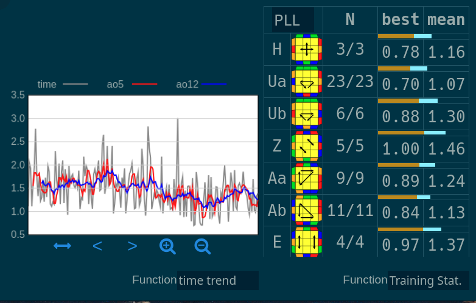

# 1. Intro

Back in 2013-2015 I remember learning algs to be extremely utterly annoying and if
I recall correctly I think it took me 2 years to just learn 
[OLL](https://www.speedsolving.com/wiki/index.php/OLL) &
[PLL](https://www.speedsolving.com/wiki/index.php?title=PLL)
simply by virtue of being a lazy kid who enjoyed practice and not learning.
However, when I returned back to cubing I managed to relearn OLL & PLL (+ other
small algsets) in 2 weeks (normal workweeks should be noted) just by having
a structured plan and structured learning sessions, here are my findings and how to apply
them to your alg learning.

:::note
To illustrate my points I'm using examples from 3x3 PLL & OLL, but the process
is equally applicable to any other twisty puzzle.
:::

# 2. Structured learning

## 2.1. Preparation

First you need to research and properly choose the algorithms that you want. 
There is no bigger waste of time than drilling bad algs, so really try a bunch. 

Some basic rules of thumb (these aren't "*technically*" always 100% true, but they
are true in most cases and hold especially true if you are starting out):
1. don't be learning lefty algs if you are righthanded and vice versa
2. don't use  algorithms with rotations in the middle of the alg (unless you 
  are [Max Park](https://www.youtube.com/shorts/nkZmzb6j8mE) ofc)
3. don't learn algorithms with a ton of **hard regrips** (**soft regrips** can 
  be okay := regrips that can be executed in between other moves with the other
  hand)
4. don't learn outdated algs

Cubing has developed and so have the fingertricks and the algorithms. As you get
more experienced you'll be able to gauge them more and more properly. There
are even ways to define an actually measurable quantity of an algorithms
ergonomic potential.

:::important
You should treat the fingertricks as a part of the algorithm, that is a 
different execution of the same sequence will most of the time require
the equal relearning time as it would to learn a different alg.
:::

### 2.1.1. PLL & OLL Resources

If you are just starting out, here are some basic resources to bootstrap you

- you can browse algs on speedcubedb (https://speedcubedb.com/)
- [Cubehead](https://www.youtube.com/@CubeHead) is a bit more noob friendly, but
  still has a decent alg selection and spends time properly explaining all
  of the required fingertricks
    - PLL: https://www.youtube.com/watch?v=QVXKNAjl_0k
    - OLL: https://www.youtube.com/watch?v=Q947zZRYMdg
- [Brina](https://www.youtube.com/@BrinaSun) has probably one of the best
  visual resources regarding 3x3 on youtube, but isn't that much noob friendly,
  you'll need to know all of the basic fingertricks and be able to recognize them
    - PLL: https://www.youtube.com/watch?v=6NU6jZNDLcY
    - OLL: https://www.youtube.com/watch?v=I7K9BqYdf1A
- [Jperm](https://www.youtube.com/@JPerm) is a cubing staple and has a ton of high
  quality resources ranging from beginner to high level topics, however, he
  hasn't been very active the last few years and his alg selection is unfortunately
  a bit dated + jperm also has a strange bias towards selecting lefty versions
  of popular righty algs, so I wouldn't recommend selecting algs based off
  his materials

:::tip
Another important tip is to know which algs have standard solutions and you
don't need to research any other algs and should just stick to the default
ones (which are just the best). For example, in PLL these are:

```
Aa, Ab, E, H, Jb, T, Y
```

For these algs, dont waste time researching alternatives, just learn the 
default ones (**with correct fingertricks**!)
:::

<!-- ### Necessary basic fingertricks -->
<!---->
<!-- Lorem ipsum -->

## 2.2. Rewrite into common triggers

Our brains are really bad at remembering random sequences of letters, which is why
we need to create some structure and better associations of what these letters 
mean and represent. Instead of writing `(R U R' U')`, you can just say `(sexy move)`,
instead of 
writing `(U R U' R')` you can just write `(inverse sexy)`, instead of 
writing `(R' F R F')` you should write `(sledge)`. Learn to read these common
triggers, for example, taking the T perm

```
R U R' U' R' F R2 U' R' U' R U R' F'
```

Rewrite this into common triggers:

```
(R U R' U') R' F (R2 U' R' U') (R U R') F'
```

And learn to read these. Below is a *non-exhaustive* table that should get you
started.

| Trigger |  Sequence | Lefty variant |
| -------- | -------- | ------------- |
| insert | `R U' R'` | `L' U L` |
| U2 insert | `R U2' R'` | `L' U2 L` |
| take out pair | `R U R'` | `L' U' L` |
| sexy move | `R U R' U'` | `L' U' L U` |
| inverse sexy | `U R U' R'` | `U' L' U L` |
| sledge | `R' F R F'` | `L F' L' F` |
| hedge | `F R' F' R` | `F' L F L'` |
| sune | `R U R' U R U2' R'` | `L' U' L U' L' U2 L` |
| antisune | `R U2' U' R U' R'` | `L' U2 L U L' U L` |
| niklas | `R U' L' U R' U' L` | - | 
| fat sexy | `r U R' U'` | `l' U' L U` |
| fat sledge | `r' F R F'` | `l F' L' F'` |
| fat sune | `r U R' U R U2' r'` | `l' U' L U' L' U2 l` |

And many, many more... This should illustrate how the triggers get combined
and composed into new ones.

:::note
Technically `U2' <=> U2`, but the apostrophe here indicates that it is usually 
more ergonomic to do the double flick with your left hand to prevent 
**overwork** := overuse of one hand and not balancing the moves between both 
hands.
:::

## 2.3. Learning the alg

Okay, you've properly researched the options and settled on an alg, you have
decoupled the sequence into common triggers, now onto actually learning it.
We'll do this in two stages

1. Quickly fit it into **short-term memory** using visual and auditory memos
2. Repeat and drill to persist it into **long-term memory**

### 2.3.1. Visual & auditory learning for short-term memorization

Now let's focus on the fastest possible way to get the alg into memory,
if you really focus this should take only 1-5mins. First put the decoupled
sequence onto some big screen that you can directly look at. After that
stretch your hands and perform the alg on your cube directly infront 
of the screen, this way you should be able to both follow the alg and also
peripherally seeing what is roughly happening on the cube. 
Here is a rough pic of what that could look like (only one hand available though,
ignore that)


After a few 
repetitions start verbally commenting what you are peripherally seeing, basically
stuff like: "taking and cycling a pair", "shifting a pair", "doing an M cycle".
Basically whatever makes sense for you. For example if we analyze the 
decoupled T perm

```
(R U R' U') R' F (R2 U' R' U') (R U R') F' 
```

This can be visually translated into

```
(taking out a pair) (sledging the pair into the open slot) (R2 into left pair) (
reinsert with a U) (restore the front slot)
```

:::important
**You need to learn visually**! For most people brute force memorization will
always take longer, use all tools at your disposal, visual and auditory
memorization, create a story or sing a song about the alg, whatever
helps you.
:::

Now do this until you can do the alg yourself, just spam it, and once you can do
it, stop looking at the screen and repeat and drill the alg while actively 
looking at the cube, try to pay attention another 10-20min. You can also
do this in a batch and learn multiple algs and switch them up during this phase.

### 2.3.2. Repetition for long-term memorization

Once you'll be sure that you won't forget the alg in the upcoming few hours,
you can safely stop drilling and now you can focus on moving the alg
into **long-term memory** and persisting it there. The key in this stage is 
not so much raw time spent, but rather the frequency and quality of your 
repetitions. For this we will use **targetted practice** and **trainers**!
Ideally you'd do this like twice a day, 10-20mins of repetitions should be plenty
enough, ofc it depends
on how many algs you are currently learning, however, less is more in this case,
you just need to commit to the daily practices and not skip them.

One common issue that you might encounter in this stage is that you will have
the alg correctly memorized but you won't be able to actively and quickly
[recall](https://en.wikipedia.org/wiki/Recall_(memory)) it.

### 2.3.3. Available trainers

Different algsets will target different communities that will usually develop
their separate tools, so we'll focus only on generic ones and PLL/OLL related 
ones.

1. [csTimer](https://cstimer.net/) -- basically the only really usable timer
  out there, however, aside from timing, cstimer is capable of way more than just
  that! If you select the scramble type and look through the `3x3x3` non WCA
  scramble categories you'll discover that cstimer can generate a huge number
  of specific substates! For PLL/OLL you can select the `3x3x3 CFOP` scramble
  category and here you can select `PLL`, `OLL` and others. One additional
  trick is that for these subsets you can add additional neat stats 
  if you enable the **Tools** panel and select `Training Stat.` which can
  show stats for PLL, OLL, COLL, ZBLL, CLL.
  
2. [SpeedCubeDB](https://speedcubedb.com/) -- a bit of a worse and slower site,
  the advantage here is though that you can "Train" any algset, Beginners, 
  intuitive F2L, advanced F2L cases, WV, CMLL, pseudo, `F <R, U> F'` and many
  more. As I said, the UX is a bit worse but can be definitely very handy
  in certain cases. Here is the [trainer](https://speedcubedb.com/trainer)
  directly.
3. [jperm.net](https://jperm.net/3x3) -- 
  [OLL trainer](https://jperm.net/algs/oll), 
  [PLL trainer](https://jperm.net/algs/pll). I personally kinda like this one.
  As I stated in the previous section, the algs here can be very outdated, so
  keep that in mind, but other than that it's pretty simple and does exactly
  what you'd expect. Especially the option to sort the algs in different
  orders and groups is really handy. Another neat feature is that you
  can mark your algs with 3 different labels and you can target just some of 
  these during your practice. Very neat >.<
    - Unlearned (grey)
    - Learning (yellow)
    - Finished (green)

# 3. Summary

Learning algs can definitely be the most boring part of this hobby, but
reading this you've hopefully seen that the annoyance can be lowered to
a minimum if one tries to approach this systematically. Moreover, there
is no worse feeling than knowing you have a much lower time potential, but
are limited by your laziness >.< Especially if it can be overcome quite
quickly.
